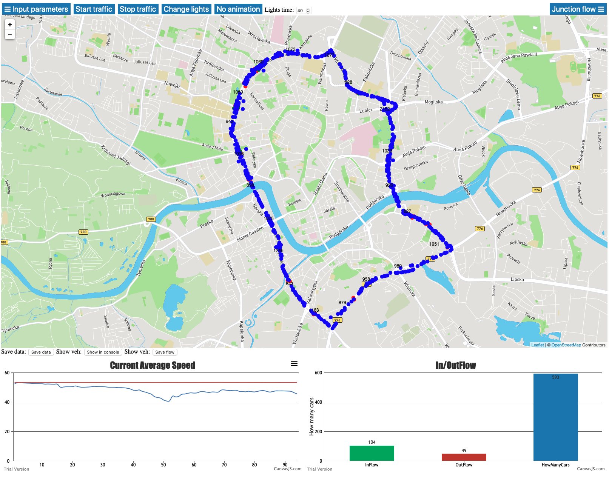
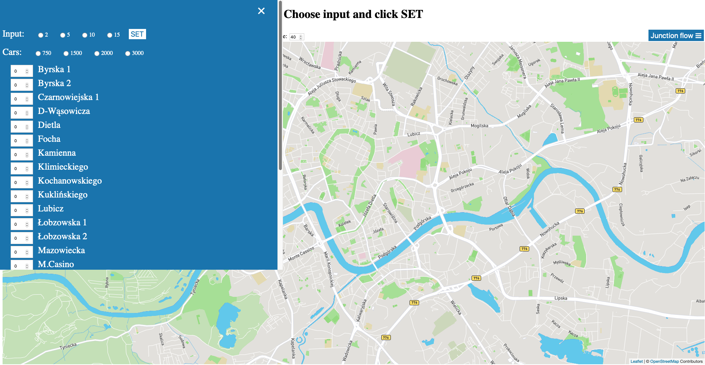

# AGH_Traffic_Simulation

Symulacja ruchu na II obwodnicy Krakowa

Zespół: Paweł Pytlowski, Krzysztof Sawina, Miłosz Wrzesień

Wygląd aplikacji:

Możliwość ręczego wybrania liczby aut na drogach wjazdowych:

